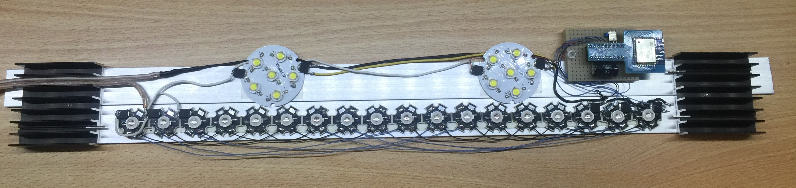
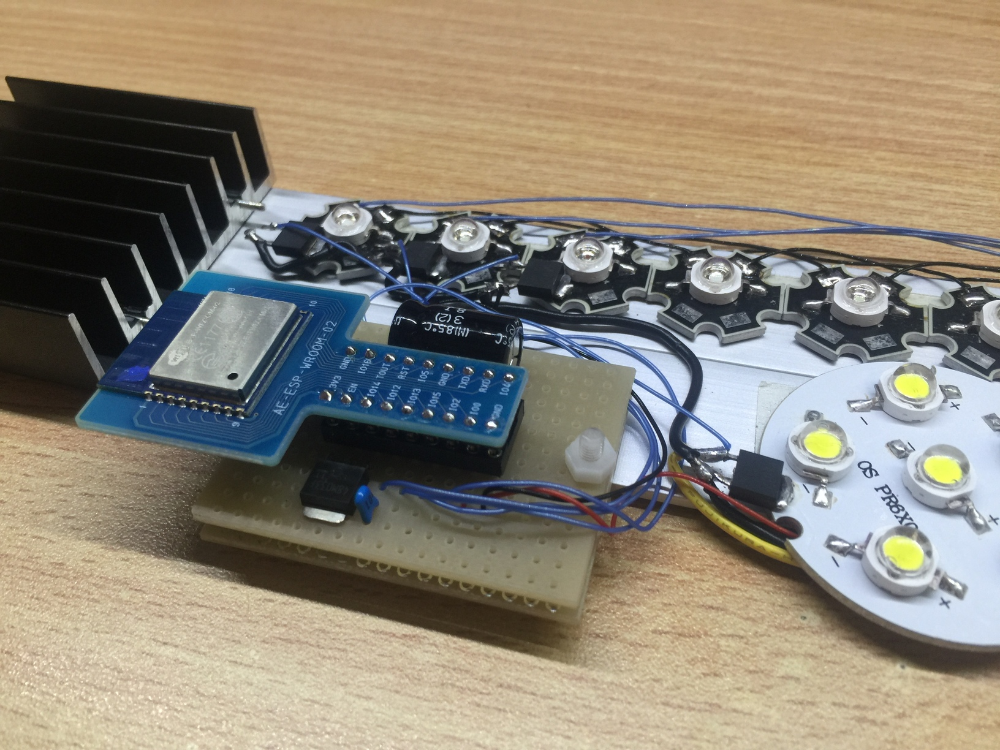
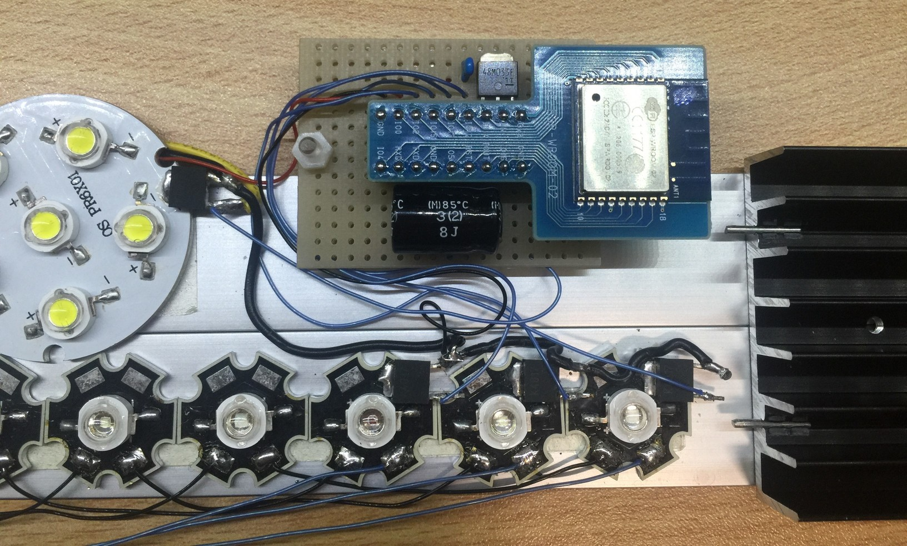
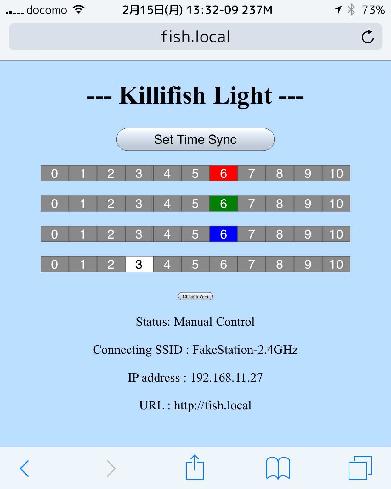
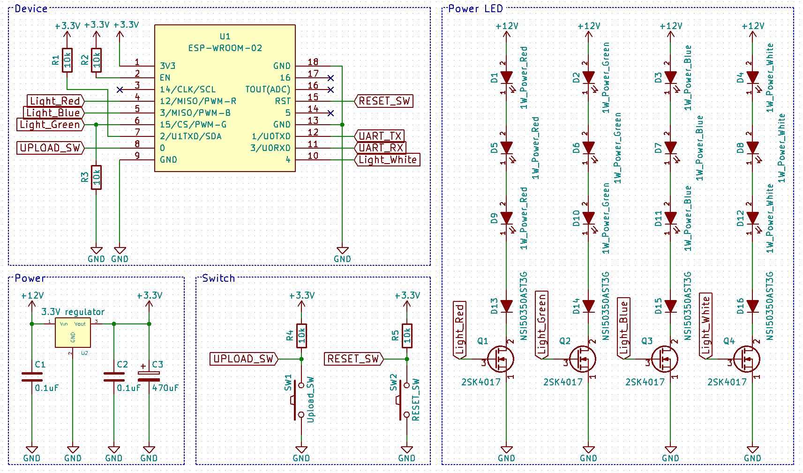

# Light-for-Fish

Lighting of the aquarium

# Required Libraries

  * [Time library for Arduino](https://github.com/PaulStoffregen/Time)

# Galleries

## Tho Whole

## Board

## Page

# Circuit Diagram

